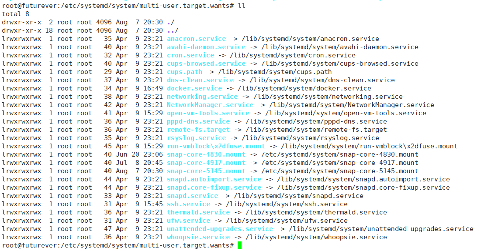

# registry

## related config for docker-compose

```shell
registry:
  restart: always
  image: registry:2
  ports:
    - 5000:5000
  environment:
    REGISTRY_HTTP_TLS_CERTIFICATE: /certs/domain.crt
    REGISTRY_HTTP_TLS_KEY: /certs/domain.key
    REGISTRY_AUTH: htpasswd
    REGISTRY_AUTH_HTPASSWD_PATH: /auth/htpasswd
    REGISTRY_AUTH_HTPASSWD_REALM: Registry Realm
  volumes:
    - /path/data:/var/lib/registry
    - /path/certs:/certs
    - /path/auth:/auth
```

## private repository url for pull images

> after modify it, need restart docker

- linux
 /etc/docker/daemon.json
- windows
 C:\ProgramData\docker\config\daemon.json

```json
{
  "allow-nondistributable-artifacts": ["myregistrydomain.com:5000"],
  "registry-mirrors": ["https://registry.docker-cn.com"]
}
```

## pull images store path modify



`vim docker.service`

```text
#ExecStart=/usr/bin/dockerd
ExecStart=/usr/bin/dockerd --graph=/data/docker

#ExecStart=/usr/bin/docker -d -H fd:// --registry-mirror=https://docker.mirrors.ustc.edu.cn

#ExecStart=/usr/bin/dockerd --graph=/data/docker --storage-driver=overlay --registry-mirror=https://xyz.mirror.aliyuncs.com

```

`systemctl daemon-reload`
`systemctl restart docker`
